<div align="center">



</div>

<br>

<div align="center">

<a href="https://github.com/b-1-o">
  
</a>
&nbsp;&nbsp;
<a href="https://www.tiktok.com/@psycho_b1o">
  
</a>
&nbsp;&nbsp;
<a href="https://www.instagram.com/__._saint">
  
</a>
&nbsp;&nbsp;
<a href="https://t.me/blood_on_music">
  
</a>
&nbsp;&nbsp;
<a href="https://discord.gg/P9aqyGCSG">
  
</a>

</div>

<br>

<div align="center">

`· · · ⛧ · · ·`

</div>

<br>

<div align="center">

### ⛧ TECH STACK


</div>

<br>

<div align="center">

### ⛧ SKILLS



</div>

<br>

<div align="center">

`· · · ⛧ · · ·`

</div>

<br>

<div align="center">

### TERMINAL

</div>

```text
┌──────────────────────────────────────────────┐
│                                              │
│  $ whoami                                    │
│  b-1-o                                       │
│                                              │
│  $ systemctl status life                     │
│  ● running                                   │
│                                              │
│  $ echo "THE FOREST REMEMBERS"               │
│  THE FOREST REMEMBERS                        │
│                                              │
└──────────────────────────────────────────────┘
```

<br>

<div align="center">


</div>

<br>

<div align="center">

`· · · ⛧ · · ·`

</div>

<br>

<div align="center">

### ⛧ GITHUB STATS

<br>

<a href="https://github.com/b-1-o">
  
</a>
&nbsp;
<a href="https://github.com/b-1-o">
  
</a>

</div>

<br>

<div align="center">

`· · · ⛧ · · ·`

<br><br>

**𝔟-𝟙-𝔬**

<sub>written in candlelight & fog</sub>

<br>

<sub>THE FOREST REMEMBERS</sub>

</div>
