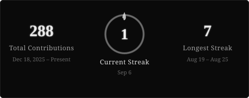

<div align="center">



<br>

# b-1-o

### Frontend Developer · UI Engineer

Building modern, responsive and interactive web experiences.

<br>

<a href="https://b-1-o.github.io/portfolio/">
  
</a>
&nbsp;
<a href="https://www.fiverr.com/users/webbio">
  
</a>
&nbsp;
<a href="https://www.linkedin.com/">
  
</a>
&nbsp;
<a href="mailto:">
  
</a>

</div>

<br>

---

## About

I'm a frontend developer focused on building clean, responsive and interactive web applications.

I work primarily with **React, JavaScript, TypeScript and modern frontend tooling**, with an emphasis on UI quality, responsive design, API integration and real-world deployment.

```text
Frontend        React · JavaScript · TypeScript · HTML · CSS
Frameworks      Next.js · Vite
Backend / API   REST APIs · PostgreSQL
Tools           Git · GitHub · Vercel
Design          UI/UX · Responsive Design · Glassmorphism
```

---

## Featured Projects

<table>
<tr>
<td width="50%">

### HEAVEN

Developer command center focused on projects, repositories, deployments and team workflows.

**Next.js · TypeScript · PostgreSQL · Vercel**

<a href="https://heaven-b1o.vercel.app/">Live Demo</a> · <a href="https://github.com/b-1-o/heaven">Repository</a>

</td>

<td width="50%">

### Music

Modern web music application with playlists, full player experience and YouTube Data API integration.

**React · JavaScript · YouTube API**

<a href="https://b-1-o.github.io/music/">Live Demo</a> · <a href="https://github.com/b-1-o/music">Repository</a>

</td>
</tr>

<tr>
<td width="50%">

### Portfolio

Personal developer portfolio designed around a minimal dark interface and interactive project presentation.

**React · Vite · JavaScript · CSS**

<a href="https://b-1-o.github.io/portfolio/">Live Demo</a> · <a href="https://github.com/b-1-o/portfolio">Repository</a>

</td>

<td width="50%">

### Build

Premium real-estate interface built as a responsive React/TypeScript web application.

**React · TypeScript · Vite**

<a href="https://b-1-o.github.io/build/">Live Demo</a> · <a href="https://github.com/b-1-o/build">Repository</a>

</td>
</tr>
</table>

---

## Tech Stack

<div align="center">


</div>

<br>

<div align="center">


</div>

---

## GitHub Activity

<div align="center">

<a href="https://github.com/b-1-o">
  
</a>
&nbsp;
<a href="https://github.com/b-1-o">
  
</a>

</div>

---

<div align="center">

### Let's build something useful.

<a href="https://b-1-o.github.io/portfolio/">
  <strong>View Portfolio →</strong>
</a>

  ·  

<a href="https://www.fiverr.com/users/webbio">
  <strong>Hire me →</strong>
</a>

<br><br>

<sub>Frontend Development · UI Engineering · Web Applications</sub>

</div>
