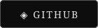
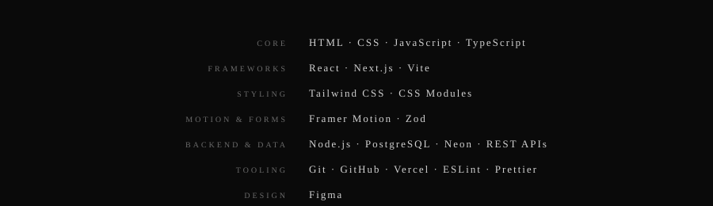

# b-1-o

### Frontend Developer · UI Engineer

React · TypeScript · Next.js · UI Engineering

  

&nbsp;&nbsp;

&nbsp;&nbsp;

&nbsp;&nbsp;

  

---

## About

I'm a frontend developer who enjoys turning complex layouts into clean, responsive interfaces — and finding elegant solutions for state, data flow and interactions along the way.

I work primarily with **React, TypeScript and Next.js**, with a focus on UI quality, responsive design, API integration and shipping real projects to production. I care about how things feel, not just how they look.

Currently open to **freelance work** and **frontend roles**.

---

## Technology Stack

---

## Featured Projects

<table>
<tr>

<td width="50%" valign="top">

<h3>Nothing</h3>

<em>Immersive product experience</em>

  

A recreation of the Nothing brand language — focused on typography, black/white contrast and polished micro-interactions.

  

<b>Role:</b> Design & Frontend Development 
<b>Challenge:</b> Reproducing the brand's signature visual rhythm without heavy libraries. 
<b>Solution:</b> Built a small design system in CSS variables and layered subtle scroll/transition animations on top.

  

<strong>React · TypeScript · Vite · CSS</strong>

  

</td>

<td width="50%" valign="top">

<h3>HEAVEN</h3>

<em>Developer command center</em>

  

A dashboard that brings projects, repositories, deployments and team activity into a single view — no more jumping between tabs.

  

<b>Role:</b> Full Frontend & Integration 
<b>Challenge:</b> Aggregating data from multiple sources with different shapes and update rates. 
<b>Solution:</b> Unified data layer on the server, streamed to a Next.js dashboard with optimistic updates.

  

<strong>Next.js · TypeScript · PostgreSQL · Vercel</strong>

  

</td>

</tr>

<tr>

<td width="50%" valign="top">

<h3>b1api</h3>

<em>Music web player</em>

  

A music app with playlists, a full player experience and YouTube-powered search — no page reloads, no friction.

  

<b>Role:</b> Frontend Development 
<b>Challenge:</b> A smooth listening experience with a persistent player across the app. 
<b>Solution:</b> Custom audio player with a queue managed through React Context, plus YouTube Data API integration and virtualized track lists.

  

<strong>React · JavaScript · YouTube API</strong>

  

</td>

<td width="50%" valign="top">

<h3>MyUI</h3>

<em>Personal design playground</em>

  

A space for experimenting with layouts, motion and micro-interactions — a living sketchbook of frontend ideas.

  

<b>Role:</b> Design & Development 
<b>Challenge:</b> Making interactive details feel intentional rather than decorative. 
<b>Solution:</b> Iterative component-based approach, tested across viewports and browsers.

  

<strong>React · JavaScript · CSS</strong>

  

</td>

</tr>
</table>

---

### Let's build something useful.

 

<a href="https://b-1-o.github.io/portfolio/">
  <strong>View Portfolio →</strong>
</a>

  

Frontend Development · UI Engineering · Web Applications

